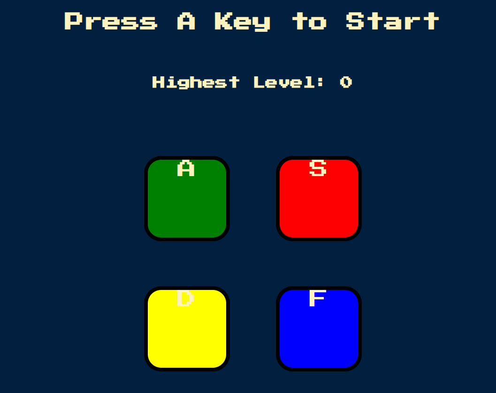

# 🎮 Simon Game  

A simple implementation of the classic **Simon Game** built with **HTML, CSS, and JavaScript (jQuery)**.  
This project was inspired by Angela Yu’s **The Complete 2023 Web Development Bootcamp** course.  

---

## 🌐 Live Demo
You can play the hosted version here:  
👉 [Simon Game on GitHub Pages](https://rakmo5.github.io/Simon/)  

---

## 🚀 Features
- Random color sequence generation.  
- User input validation with sounds & animations.  
- Level tracking system (displayed dynamically).  
- High Score tracking (remains visible after restart).  
- Smooth sequence playback with delays using `setInterval`.  
- Responsive UI for fun on both desktop & mobile.  

---

## 🖼 Demo
  

---

## 📂 Project Structure

├── index.html # Main HTML file
├── style.css # Styling
├── game.js # Game logic (jQuery + JS)
├── sounds/ # Sound files for each color
└── README.md # Project documentation

---

## 🛠️ Tech Stack
- HTML5  
- CSS3  
- JavaScript (ES6)  
- jQuery  

---

## 🎓 Learning Outcomes
By building this project, I practiced:  
- DOM manipulation using **jQuery**  
- Handling **events** (`click`, `keypress`)  
- Using **setInterval** and callbacks for sequencing  
- State management with variables like `level`, `started`, `acceptingInput`, `highScore`  
- Implementing **game over** and **restart logic**  

---

## 🔑 How to Play
1. Press any key (or tap screen on mobile) to start.  
2. Watch the sequence of flashing colors.  
3. Repeat the sequence by clicking the colored buttons.  
4. Each level adds one more step to the sequence.  
5. Wrong input? Game Over! Restart and try to beat your **highest level**.  

---

## 📜 License
This project is for **educational purposes only**.  
Inspired by Angela Yu’s [The Complete 2023 Web Development Bootcamp](https://www.udemy.com/course/the-complete-web-development-bootcamp/) course.  

Feel free to fork and modify, but please give credit.  

---

✨ Have fun challenging your memory skills!
